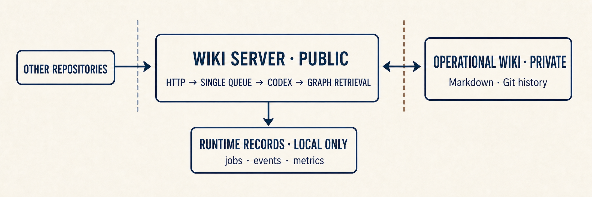

# Wiki Server

**English** | [한국어](README.md)

Local agent server for maintaining a Git-managed operational wiki.

It receives work over HTTP, runs it through Codex, and exposes retrieval, Git
state, and job events in one desktop app. The actual wiki stays in a separate
private Git repository. This repository contains only the server, desktop app,
tests, design documents, and a minimal first-run template.

## Core

- Server code and wiki content keep separate Git histories.
- Every operation passes through the local HTTP API and a single queue.
- Retrieval searches the graph first and reads only selected document ranges.
- Job state, events, and retrieval usage remain observable as runtime data.

## Runtime Structure



The service is local-only and unauthenticated. It should not be exposed outside
the local machine without adding authentication and network controls.

Repository ownership and public API boundaries are defined in `AGENTS.md`.
`docs/code-map.md` routes changes to their owning modules, and
`docs/code-quality.md` records the verification rules.

## Install

The [latest release](https://github.com/leesh7807/wiki-server/releases/latest)
contains 64-bit packages and `SHA256SUMS.txt`. Wiki operations require Git and the
Codex CLI to be available on the system. Installed packages do not require
Node.js.

Windows:

1. Download `Wiki-Server-<version>-x64.exe`.
2. Run the installer, then start Wiki Server.

Debian or Ubuntu:

```sh
sudo apt install ./Wiki-Server-<version>-amd64.deb
```

Other Linux distributions can use the AppImage. Keep it in a stable location:

```sh
chmod +x Wiki-Server-<version>-x86_64.AppImage
./Wiki-Server-<version>-x86_64.AppImage
```

The first launch creates a minimal wiki with independent Git history and never
overwrites an existing wiki.

- Windows data: `%LOCALAPPDATA%\Wiki Server`
- Linux data: `${XDG_DATA_HOME:-~/.local/share}/wiki-server`
- **Launch at login**: starts the server and tray in the background
- Closing the window: keeps the app running in the tray
- **Quit** in the tray: stops the server and app

Installing a new version or uninstalling the app preserves the operational wiki
and runtime data. AppImage login startup points to the original file, so moving
it requires enabling the setting again. See `docs/desktop-app.md` for the data
boundary.

## Development

Install dependencies and run the desktop app with managed user data:

```console
npm ci
npm run app
```

Run only the server with `npm run dev`.

Run the desktop app against sibling `../wiki` or an explicit `WIKI_ROOT` with
`npm run tray`.

Defaults:

- Host: `127.0.0.1`
- Port: `55173` (private local default; the desktop app selects a nearby free
  port and warns in-app if the default is occupied)
- Wiki root: `WIKI_ROOT`; source-only development falls back to sibling
  `..\wiki` during migration
- Runtime data: `.cache/wiki-server`, or `WIKI_SERVER_DATA_DIR`
- Jobs: `.cache/wiki-server/jobs`
- Codex CLI: standalone `@openai/codex`; `CODEX_BIN` may provide an explicit
  executable or command path, otherwise the server resolves `codex` from PATH
- Codex home: `.cache/wiki-server/codex-home`, or `WIKI_CODEX_HOME`
- Health diagnostics: detected Codex version plus separate protocol/model
  readiness; both runner transports use the isolated Codex home
- Runner: app-server first, or `WIKI_AGENT_RUNNER=exec`
- Models: query defaults to `gpt-5.6-terra`; ingest and lint default to
  `gpt-5.6-sol`; `WIKI_CODEX_MODEL` is the shared fallback;
  `WIKI_CODEX_QUERY_MODEL`, `WIKI_CODEX_INGEST_MODEL`, and
  `WIKI_CODEX_LINT_MODEL` override it per command
- Reasoning effort: `high` by default; `WIKI_CODEX_REASONING_EFFORT` is the
  shared fallback; `WIKI_CODEX_QUERY_REASONING_EFFORT`,
  `WIKI_CODEX_INGEST_REASONING_EFFORT`, and
  `WIKI_CODEX_LINT_REASONING_EFFORT` override it per command
- Retrieval: deterministic Markdown graph routing is enabled by default. The
  agent can repeat metadata-only searches with the internal `wiki-retrieval`
  command, then explicitly read one heading, line range, or whole selected
  document. `log.md`, `raw/**`, and assets stay outside normal search context;
  set `WIKI_GRAPH_RETRIEVAL=0` to disable both initial and repeated retrieval
- Event storage: large event payloads are compressed inside the existing
  `raw-events/<jobId>.jsonl` file and transparently restored by the API; set
  `WIKI_SERVER_COMPRESS_EVENT_LOGS=0` to keep new records fully plain JSON

Open the local client at `http://127.0.0.1:55173/client`.

`npm run tray` starts the Electron desktop app and opens the client in its main
window. The desktop renderer is separate from the compatibility `/client`
website. Closing the window hides it to the tray; use **Open Wiki Server** to
restore it. Login and detached startup remain background-only.

User-owned wiki management surfaces and their recommended order are tracked in
`docs/user-management-surfaces.md`.

## API

Other repositories call the local HTTP API directly. The desktop app's **Wiki**
screen provides a short guide whose Base URL reflects the actual selected port;
copy that guide when the app reports a port fallback.

- `POST /query` with `{ "content": "neutral question text" }`
- `POST /ingest` with `{ "content": "file path, document text, or Source / Ingest context block" }`
- `POST /lint` with no body or `{}`
- `GET /jobs/<jobId>`
- `GET /jobs/<jobId>/events`
- `POST /jobs/<jobId>/cancel`
- `GET /metrics/jobs`
- `GET /health`
- `GET /` and `GET /client`

`POST /query`, `/ingest`, and `/lint` return `202` with `jobId`, `status`, and
`eventsUrl`. Read successful answers from `result.lastAgentMessage`.

Graph exploration is not an additional public API contract. The server installs
`wiki-retrieval` into the isolated agent environment and uses a token-protected
loopback RPC only as an internal process boundary. Search results contain
identity, metadata, revision relations, graph connections, document outlines,
and factual match fields, but no document body. Content enters agent context
only after an explicit `wiki-retrieval read` selection. General text files
submitted to ingest are sampled by content rather than ranked from their path or
extension alone.

Job `metrics.retrievalObservability` summarizes best-effort retrieval use from
agent events: candidate use ratio, graph versus filesystem search counts,
selective versus full-document reads, lint partition coverage, broad-root and
broad excluded-path access, targeted provenance/log checks, repeated reads, and
the largest observed search output. `metrics.executionObservability` separately
records the 12,000-character output budget, violations, repeated completed
commands, and token/context high-water values. These are mechanical signals,
not a definitive file-read ledger, model-call count, or billing usage.

## Validation

```powershell
npm test
npm run typecheck
npm run build
```

The real Codex app-server integration remains opt-in:

```powershell
$env:WIKI_RUN_CODEX_INTEGRATION = "1"
npm run test:integration
```

## Wiki Ownership

The application repository never tracks user wiki content. `wiki-template/` is
only a small first-run scaffold. The installed operational wiki is independently
versioned, can be opened from the Wiki screen, and remains after app updates or
uninstall. Historical migration details are in
`docs/migration-from-wiki-tools.md`.

The Wiki screen can explicitly import an operational wiki from any Git remote
understood by the system Git client, including GitHub, GitLab, private HTTPS,
and SSH remotes. Import clones and validates `AGENTS.md`, `index.md`, and
`wiki/` in same-volume staging, previews content changes and the timestamped
backup path, then stops the local server for an atomic rename-based swap. The
existing wiki is never overwritten or deleted. Pull is manual and is offered
only after a fetch proves that a clean worktree can fast-forward.

On Windows, import uses a short sibling staging path and enables Git
`core.longpaths` for clone and the imported repository. Deep user-owned asset
paths therefore do not fail merely because staging adds another long prefix.

Authentication belongs to Git Credential Manager or SSH. The app rejects
credentials embedded in HTTPS URLs and redacts credential-shaped log content;
it never stores access tokens, passwords, or SSH keys in Wiki Server settings.

## Design Acknowledgement

Design reference: [tw93/Kami](https://github.com/tw93/Kami)

## License

Wiki Server is released under the [MIT License](LICENSE).
