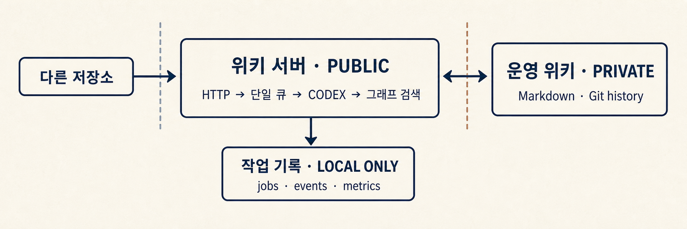

# Wiki Server

**한국어** | [English](README.en.md)

운영 위키를 로컬에서 유지하기 위한 에이전트 서버.

HTTP 작업 수신, Codex 실행, 검색 과정·Git 상태·작업 이벤트를 한 앱에 통합. 실제
위키는 별도 private Git 저장소로 유지. 이 저장소에는 서버, 데스크톱 앱, 테스트,
설계 문서, 최소 초기 템플릿만 포함.

## 핵심

- 서버 코드와 실제 위키: 서로 다른 Git 이력
- 작업 실행: 로컬 HTTP API와 단일 큐
- 위키 검색: 링크 그래프 탐색 후 필요한 범위만 읽기
- 런타임 관측: 작업 상태, 이벤트, 검색 사용량

## 동작 구조



인증 없는 로컬 전용 서버. 별도의 인증·네트워크 제어 없이 로컬 컴퓨터 밖으로
노출하면 안 됨.

관련 문서:

- 저장소 소유권과 공개 API 경계: `AGENTS.md`
- 모듈별 변경 위치: `docs/code-map.md`
- 검증 기준: `docs/code-quality.md`

## 설치

[최신 Release](https://github.com/leesh7807/wiki-server/releases/latest)에서 64비트 배포본과
`SHA256SUMS.txt` 제공. 위키 작업 실행에는 시스템에서 Git과 Codex CLI를 사용할 수
있어야 함. 설치본에는 Node.js가 필요하지 않음.

Windows:

1. `Wiki-Server-<version>-x64.exe` 다운로드
2. 설치 파일 실행 후 Wiki Server 시작

Debian·Ubuntu 계열 Linux:

```sh
sudo apt install ./Wiki-Server-<version>-amd64.deb
```

그 외 Linux에서는 AppImage 사용. 이동하지 않을 위치에 둔 뒤 실행:

```sh
chmod +x Wiki-Server-<version>-x86_64.AppImage
./Wiki-Server-<version>-x86_64.AppImage
```

최초 실행 시 최소 위키와 독립된 Git 이력 생성. 기존 위키는 덮어쓰지 않음.

- Windows 데이터: `%LOCALAPPDATA%\Wiki Server`
- Linux 데이터: `${XDG_DATA_HOME:-~/.local/share}/wiki-server`
- 설정의 `로그인 시 자동 시작`: 다음 로그인부터 서버와 트레이를 백그라운드에서 실행
- 창 닫기: 트레이에서 계속 실행
- 트레이의 `종료`: 서버와 앱 종료

새 버전 설치와 앱 제거는 운영 위키와 런타임 데이터를 유지. AppImage 자동 시작은
설정 시점의 원본 파일 경로를 사용하므로 파일을 옮긴 경우 다시 설정해야 함. 세부
데이터 경계는 `docs/desktop-app.md` 참고.

## 개발

의존성 설치 후 관리형 데이터 경로로 데스크톱 앱 실행:

```console
npm ci
npm run app
```

서버만 실행: `npm run dev`

형제 디렉터리 `../wiki` 또는 `WIKI_ROOT`를 사용하는 데스크톱 개발 실행:
`npm run tray`

기본값:

- 호스트: `127.0.0.1`
- 포트: `55173`; 사용 중이면 데스크톱 앱이 인접한 빈 포트 선택
- 위키 루트: `WIKI_ROOT`; 소스 개발 환경에서는 형제 디렉터리 `..\wiki` 사용
- 런타임 데이터: `.cache/wiki-server` 또는 `WIKI_SERVER_DATA_DIR`
- 작업 데이터: `.cache/wiki-server/jobs`
- Codex CLI: `CODEX_BIN`으로 지정한 실행 파일, 아니면 PATH의 `codex`
- Codex 홈: `.cache/wiki-server/codex-home` 또는 `WIKI_CODEX_HOME`
- 실행 방식: app-server 우선, `WIKI_AGENT_RUNNER=exec`으로 exec 고정 가능
- 모델: query는 기본 `gpt-5.6-terra`, ingest와 lint는 기본 `gpt-5.6-sol`;
  `WIKI_CODEX_MODEL` 또는 명령별 환경 변수로 변경 가능
- 추론 강도: 기본 `high`; 공통 또는 명령별 환경 변수로 변경 가능
- 검색: Markdown 링크 그래프와 내부 `wiki-retrieval` 명령;
  `WIKI_GRAPH_RETRIEVAL=0`으로 비활성화 가능
- 이벤트 저장: 큰 payload는 `raw-events/<jobId>.jsonl` 안에서 압축;
  `WIKI_SERVER_COMPRESS_EVENT_LOGS=0`이면 일반 JSON으로 저장

로컬 웹 클라이언트: `http://127.0.0.1:55173/client`

## API

- `POST /query`와 `{ "content": "question text" }`
- `POST /ingest`와 `{ "content": "file path, document text, or context" }`
- `POST /lint`와 본문 없음 또는 `{}`
- `GET /jobs/<jobId>`
- `GET /jobs/<jobId>/events`
- `POST /jobs/<jobId>/cancel`
- `GET /metrics/jobs`
- `GET /health`
- `GET /` 및 `GET /client`

명령 응답: `202`와 `jobId`, `status`, `eventsUrl`. 성공한 답:
`result.lastAgentMessage`.

그래프 탐색은 공개 API가 아닌 서버 내부 경계. 검색 결과에는 본문 대신 문서
식별자, 메타데이터, 개정 관계, 연결, 개요, 일치 필드만 포함. 에이전트가
`wiki-retrieval read`로 문서와 범위를 고른 뒤 본문을 문맥에 추가. `log.md`,
`raw/**`, 에셋은 일반 검색에서 제외.

관측 지표:

- `retrievalObservability`: 후보 사용, 그래프·파일시스템 검색, 부분·전체 문서 읽기
- `executionObservability`: 출력 예산, 관찰된 토큰·문맥 값

기계적 관측값이며 파일 읽기 원장이나 과금 사용량은 아님.

## 위키와 Git

- 애플리케이션 저장소: 사용자 위키 내용 미추적
- `wiki-template/`: 새 설치를 위한 최소 뼈대
- 운영 위키: 앱과 독립된 Git 이력, 앱 업데이트·제거 후에도 유지

데스크톱 앱의 **Wiki** 화면에서 GitHub, GitLab, private HTTPS, SSH 등 시스템 Git
클라이언트가 다룰 수 있는 원격 저장소 가져오기 가능.

가져오기 순서:

1. `AGENTS.md`, `index.md`, `wiki/` 구조 검증
2. 현재 위키와의 변경점, 백업 경로 표시
3. 기존 위키를 타임스탬프 경로로 이동
4. 검증한 저장소로 교체

기존 데이터 덮어쓰기·삭제 없음. pull은 fetch 결과 작업 트리가 clean이고
fast-forward 가능한 경우에만 명시적으로 실행. 인증은 Git Credential Manager나
SSH에 위임. 자격증명이 들어간 URL 거부. 토큰, 비밀번호, SSH key 저장 없음.

## 검증

```powershell
npm test
npm run typecheck
npm run build
```

실제 Codex app-server 통합 테스트는 필요할 때만 활성화.

```powershell
$env:WIKI_RUN_CODEX_INTEGRATION = "1"
npm run test:integration
```

## 디자인

디자인 참고: [tw93/Kami](https://github.com/tw93/Kami)

## 라이선스

[MIT License](LICENSE)
